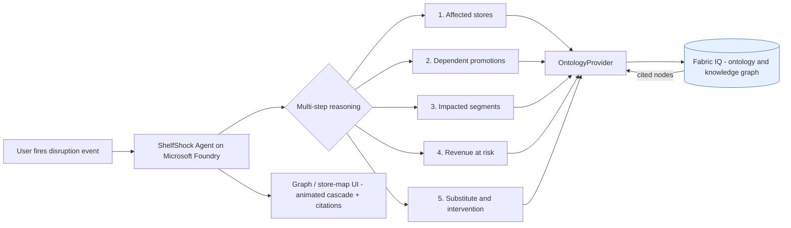

# ShelfShock — Architecture

```mermaid
flowchart LR
    U[User fires disruption event] --> A[ShelfShock Agent on Microsoft Foundry]
    A --> R{Multi-step reasoning}
    R --> S1[1. Affected stores]
    R --> S2[2. Dependent promotions]
    R --> S3[3. Impacted segments]
    R --> S4[4. Revenue at risk]
    R --> S5[5. Substitute and intervention]
    S1 & S2 & S3 & S4 & S5 --> Q[OntologyProvider]
    Q --> F[(Fabric IQ - ontology and knowledge graph)]
    F -- cited nodes --> Q
    A --> V[Graph / store-map UI - animated cascade + citations]
    classDef iq fill:#e6f0ff,stroke:#2f6fdb;
    class F iq;
```
